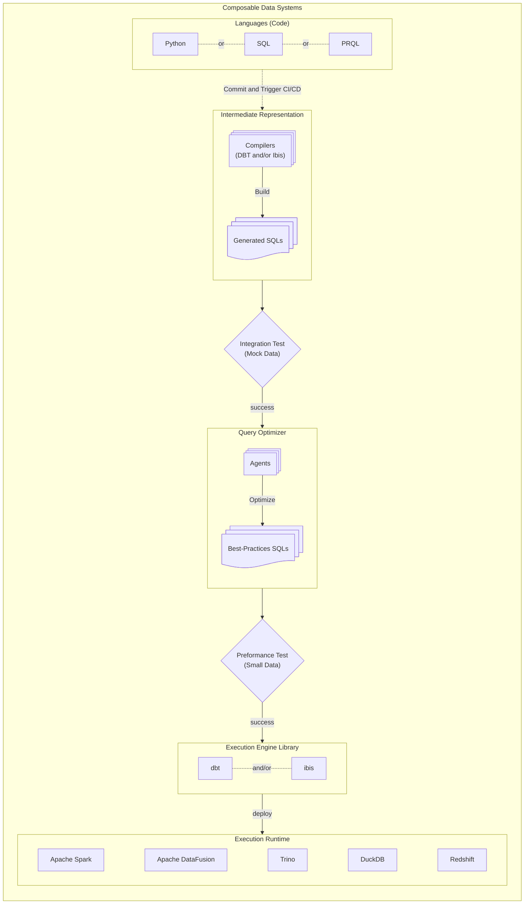

```mermaid
flowchart TB
subgraph composable_data_systems["Composable Data Systems"]
    direction TB
    subgraph language["Languages (Code)"]
        Python -.-|or| SQL -.-|or| PRQL
    end

    subgraph ir["Intermediate Representation"]
        direction TB
        compilers@{ shape: processes, label: "Compilers
        (DBT and/or Ibis)" } -->|Build| generated-sql@{ shape: docs, label: "Generated SQLs" }
    end
    language -.->|Commit and Trigger CI/CD| ir

    subgraph query-optimizer["Query Optimizer"]
        direction TB
        agent@{ shape: processes, label: "Agents" }
        best-practiced-sql@{ shape: docs, label: "Best-Practices SQLs" }
        agent -->|Optimize| best-practiced-sql
    end
    ir --> integration-test@{ shape: diamond, label: "Integration Test
    (Mock Data)" } -->|success| query-optimizer

    subgraph execution-engine-library["Execution Engine Library"]
        dbt -.-|and/or| ibis
    end
    query-optimizer --> preformance-test@{ shape: diamond, label: "Preformance Test
    (Small Data)" } -->|success| execution-engine-library

    subgraph execution-runtime["Execution Runtime"]
        direction LR
        spark["Apache Spark"]
        datafusion["Apache DataFusion"]
        trino["Trino"]
        duckdb["DuckDB"]
        redshift["Redshift"]

        spark ~~~ datafusion ~~~ trino ~~~ duckdb ~~~ redshift
    end
    execution-engine-library -->|deploy| execution-runtime

end

%% subgraph observability["Security and Observability"]
%%     Authn ~~~ Authz ~~~ fgac["Fine-Grained
%%     Access Control"]
%%     Monitoring ~~~ Logging ~~~ Auditing
%% end
%% direction TB
%% composable_data_systems -.- observability

```
