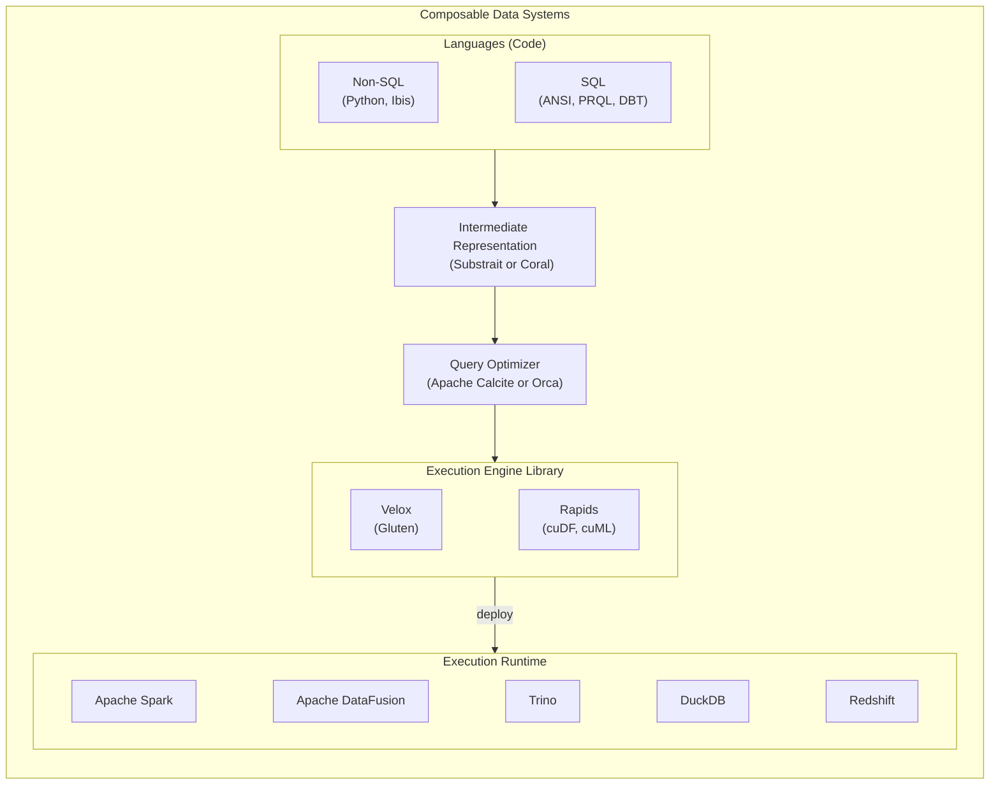

### The Composable Codex

[Composable data management at Meta](https://engineering.fb.com/2024/05/22/data-infrastructure/composable-data-management-at-meta/) and [The Composable Data Management System Manifesto](https://www.vldb.org/pvldb/vol16/p2679-pedreira.pdf)

[The Future Roadmap for the Composable Data Stack - Wes McKinney - Data Council Austin 2024](https://www.slideshare.net/slideshow/the-future-roadmap-for-the-composable-data-stack-wes-mckinney-data-council-austin-2024/267200570)

[The Composable Codex](https://voltrondata.com/codex)

### Data Catalog

- Apache Hive
- Apache Iceberg REST catalog
  - [Apache Polaris](https://github.com/apache/polaris) and [Snowflake blog post](https://www.snowflake.com/en/blog/introducing-polaris-catalog/)
  - [Apache Gravitino](https://github.com/apache/gravitino) and [Datastrato blog post](https://datastrato.ai/blog/gravitino-iceberg-rest-catalog-service/)
  - [AWS Glue](https://docs.aws.amazon.com/zh_tw/glue/latest/dg/start-data-catalog.html)
- [Nessie](https://projectnessie.org/)

### Languages

#### Non-SQL

Python, [Ibis-project](https://ibis-project.org/), Scala, Java

#### SQL

ANSI SQL, [PRQL](https://prql-lang.org/), [DBT](https://www.getdbt.com/)

### Intermediate Representation

#### Subtrait

[Subtrait](https://substrait.io/)

#### Coral IR

[Linkedin - Coral](https://github.com/linkedin/coral)

### Query Optimizers

#### Apache Calcite

[Composable Data Systems: Lessons from Apache Calcite Success](https://www.querifylabs.com/blog/composable-data-systems-lessons-from-apache-calcite-success)

### Execution Libraries

#### CPU based - Velox and ecosystem

[Facebook - Velox](https://github.com/facebookincubator/velox) and [Apache Gluten](https://gluten.apache.org/)

[Velox: meta's unified execution engine](https://dl.acm.org/doi/abs/10.14778/3554821.3554829)

#### GPU based - RAPIDS and ecosystem

[nVidia RAPIDS](https://rapids.ai/) and, [cuDF](https://docs.rapids.ai/api/cudf/stable/), [cuML](https://docs.rapids.ai/api/cuml/stable/), [cuGraph](https://docs.rapids.ai/api/cugraph/stable/) and [more](https://github.com/rapidsai)

### Open Table Formats

[The History and Evolution of Open Table Formats - Part I](https://www.pracdata.io/p/the-history-and-evolution-of-open?r=23jwn)

[LST-Bench: Benchmarking Log-Structured Tables in the Cloud](https://arxiv.org/html/2305.01120v3)

- Apache Hudi
- Apache Iceberg
- Delta Lake
- Apache XTable

#### Protocols

- [Python dataframe interchange protocol](https://data-apis.org/dataframe-protocol/latest/index.html)

### Rust for Big Data

- [Arroyo - Distributed stream processing engine in Rust](https://github.com/ArroyoSystems/arroyo)
- [Apache DataFusion - an extensible query engine written in Rust that uses Apache Arrow as its in-memory format](https://datafusion.apache.org/)

### Misc

- [Amazon Redshift query-identifiers](https://aws.amazon.com/tw/about-aws/whats-new/2024/10/amazon-redshift-query-identifiers-performance-monitoring/)
- [Apache Spark - Catalyst Optimizer](https://www.databricks.com/glossary/catalyst-optimizer)
- [Consortium for Python Data API Standards](https://data-apis.org/)
- [sqlglot](https://github.com/tobymao/sqlglot)
- LLVM API
- [arroyo](https://www.arroyo.dev/)
- [Daft](https://github.com/Eventual-Inc/Daft)
- [Voltron Data](https://voltrondata.com/) and [benchmarks](https://voltrondata.com/benchmarks/)
- [cs.cmu.edu - Databases in 2024](https://www.cs.cmu.edu/~pavlo/blog/2025/01/2024-databases-retrospective.html)
- [Model Once, Represent Everywhere: UDA (Unified Data Architecture) at Netflix](https://netflixtechblog.com/uda-unified-data-architecture-6a6aee261d8d)
- [The Road to Composable Data Systems: Thoughts on the Last 15 Years and the Future](https://wesmckinney.com/blog/looking-back-15-years/)