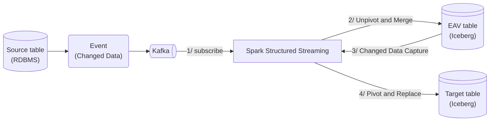

## TL;DR

如果使用來源資料庫成熟的 Write-Ahead Logging (WAL) 機制例如 MySQL binlog (Binary log), PostgreSQL WAL 或成熟工具如 Kafka Connector for PostgreSQL/MySQL, AWS DMS (Database Migration Service) 的話，則通常不會遇到這個問題

## 場景

希望將某資料庫中的 source_table 同步到 Apache Iceberg 格式的 target_table 中，其中

1. 透過某種自幹的方式取得 source_table 的 CDC 事件並將資料送到 Apache Kafka
1. 以 Apache Kafka 來串流 CDC 事件
1. 使用 Apache Spark 從 Apache Kafka 讀取資料，然後處理資料及寫入資料表

## 問題可能是怎麼來的

### 工程面

1. 將 CDC 事件以平行非同步的方式發送到 Kafka
    - ex. 後端 (Backend) 程式在執行資料庫操作之後以非同步的方式將異動資料寫到 Apache Kafka
    - ex. 透過定時執行一段 SQL 取得 source_table 的 CDC 事件然後以平行非同步的方式發送到 Kafka
2. 擷取 CDC 事件的時候為了省流量 (降低延遲) 就沒有包含完整記錄 (Record) 資訊。註解：這在同質關聯式資料庫之間做資料同步是可行的

### 資料面: FULL 或 Partial

先假設 source_table 有欄位: PK, col_1, col_2, col_3, updated_time 如下圖

| PK | col_1 | col_2 | col_3 | updated_time |
| -- | ----- | ----- | ----- | ------------ |
| 1  | aaa11 | bbb11 | 11111 | 2025-01-01 00:00:00 |
| 2  | aaa22 | bbb22 | 22222 | 2025-01-01 00:00:00 |

我們分別在不同時間點執行以下 SQL statements

```sql
-- statement 1
DELETE FROM source_table WHERE PK = 1;

-- statement 2
UPDATE source_table SET
    col_3 = 0.002,
    updated_time = CURRENT_TIMESTAMP()
WHERE PK = 2;

-- statement 3
INSERT INTO source_table (PK, col_1, col_2, col_3, updated_time)
VALUES (3, aaa33, bbb33, 33333, CURRENT_TIMESTAMP());
```

異動後的 source_table 如下圖

| PK | col_1 | col_2 | col_3 | updated_time |
| -- | ----- | ----- | ----- | ------------ |
| 2  | aaa22 | bbb22 | 0.002 | 2025-01-01 00:00:02 |
| 3  | aaa33 | bbb33 | 33333 | 2025-01-01 00:00:03 |

這裡我們需先知道：從來源資料庫送出來的異動後資訊稱為 after_image (變更後的狀態)，after_image __通常__ 是以下兩種形式

> __通常__ CDC 事件會有兩個重要的添加欄位 (以下用 `_action` 和 `_timestamp` 表達):
> 1. _action 欄位: 用以表達這個事件的操作，例如 insert, delete, update
> 1. _timestamp 欄位: 用以表達這個事件的時間戳記

1. Full: 表示包含完整的資料列 (以下範例已 JSON 表示)

    ```json
    {
        "after_image": [
            {
                "_action": "_delete",
                "_timestamp": "2025-01-01 00:00:01",
                "PK": 1,
                "col_1": "aaa11",
                "col_2": "bbb11",
                "col_3": 11111,
                "updated_time": "2025-01-01 00:00:00"
            },
            {
                "_action": "_update",
                "_timestamp": "2025-01-01 00:00:02",
                "PK": 2,
                "col_1": "aaa22",
                "col_2": "bbb22",
                "col_3": 0.002,
                "updated_time": "2025-01-01 00:00:02"
            },
            {
                "_action": "_insert",
                "_timestamp": "2025-01-01 00:00:03",
                "PK": 3,
                "col_1": "aaa333",
                "col_2": "bbb333",
                "col_3": 33333,
                "updated_time": "2025-01-01 00:00:03"
            }
        ]
    }
    ```

2. Partial: 僅包含主鍵和異動欄位 (以下範例已 JSON 表示)

    ```json
    {
        "after_image": [
            {
                "_action": "_delete",
                "_timestamp": "2025-01-01 00:00:01",
                "PK": 1
            },
            {
                "_action": "_update",
                "_timestamp": "2025-01-01 00:00:02",
                "PK": 2,
                "col_3": 0.002,
                "updated_time": "2025-01-01 00:00:02"
            },
            {
                "_action": "_insert",
                "_timestamp": "2025-01-01 00:00:03",
                "PK": 3,
                "col_1": "aaa333",
                "col_2": "bbb333",
                "col_3": 33333,
                "updated_time": "2025-01-01 00:00:03"
            }
        ]
    }
    ```

### Streaming processing (流氏處理) 面: Late Data (遲到的資料)

理想上，我們期望事件都是依照 event timestamp (事件時間戳記) 循序的被 Apache Spark Strutected Streaming 接收到，如下圖

> 來源為 Apache Spark 官方文件：[handling-late-data-and-watermarking](https://spark.apache.org/docs/3.5.1/structured-streaming-programming-guide.html#handling-late-data-and-watermarking)


## 問題分析和解決

### 當 after_image 是 Full 格式的時候

> 這裡的核心概念是：我們只需要一直去比對異動資料是否比目的資料更新鮮即可

當我們可以保證 after_image 是 Full 的格式的時候，下游的 Spark Structured Streaming 不需要在乎接收到的事件是否依照 updated_time 排序也可以輕鬆在 foreachBatch 中使用 Window Function 先將 micro-batch 進行一次重排序並只取最新一筆紀錄然後再執行 `MERGE` 指令，如此就能將資料保持 eventually consistent (最終一致)。以下為範例

```python
'''
sample data:
{"_action": "_delete", "_timestamp": "2025-01-01 00:00:01", "PK": 1, "col_1": "aaa11", "col_2": "bbb11", "col_3": 11111, "updated_time": "2025-01-01 00:00:00"}
{"_action": "_update", "_timestamp": "2025-01-01 00:00:02", "PK": 2, "col_1": "aaa22", "col_2": "bbb22", "col_3": 0.002, "updated_time": "2025-01-01 00:00:02"}
{"_action": "_insert", "_timestamp": "2025-01-01 00:00:03", "PK": 3, "col_1": "aaa333", "col_2": "bbb333", "col_3": 33333, "updated_time": "2025-01-01 00:00:03"}
'''

## Fill updated_time when _action is delete
df = df.withColumn("updated_time", coalesce("updated_time", "_timestamp"))

## Apply De-duplication logic on input data, to pickup latest record based on updated_time
window_spec = Window.partitionBy(
    col("PK")
).orderBy(col("updated_time").desc())
deduplicated = df.withColumn(
    "row_num", row_number().over(window_spec)
).filter(col("row_num") == 1).drop("row_num")

deduplicated.createOrReplaceTempView("kafka_view")
```

```SQL
-- spark.sql(merge_statement)
-- SparkSQL with Iceberg extension
MERGE INTO target_table t
USING (
    SELECT PK, col_1, col_2, col_3, updated_time, _action
    FROM kafka_view
) s
WHEN MATCHED AND _action = _delete AND s.updated_time >= t.updated_time THEN DELETE
WHEN MATCHED AND _action = _update AND s.updated_time >= t.updated_time THEN UPDATE SET
    t.PK = s.PK,
    t.col_1 = s.col_1,
    t.col_2 = s.col_2,
    t.col_3 = s.col_3,
    t.updated_time = s.updated_time
WHEN NOT MATCHED THEN 
    INSERT (PK, col_1, col_2, col_3, updated_time)
    VALUES (s.PK, s.col_1, s.col_2, s.col_3, s.updated_time)
```

### 當 after_image 是 Partial 格式的時候

> 如果是同質的關聯式資料庫之間的同步，或者說 row-based (行式) 儲存的話，則 partial 格式是相對有效率又節省頻寬

在 after_image 是 Partial 格式並且是要將資料同步至 Lake House (資料湖倉) 的時候，會遇到的幾個問題是：

1. 不容易實現平行處理
2. Lake House 通常是 column-based (列式) 儲存，對於"更新"某行中的某幾列是相對沒效率 (可以想成磁頭需要移動比較多次，可參考 [Apache Parquet - File format](https://parquet.apache.org/docs/file-format/) 想像)。

如果非要處理的話，可以使用 Entity-Attribute-Value (EAV) 資料結構或者可以稱之為 long and skinny table (長且窄的表)

以下為簡易架構圖：



最後附上範例程式碼


